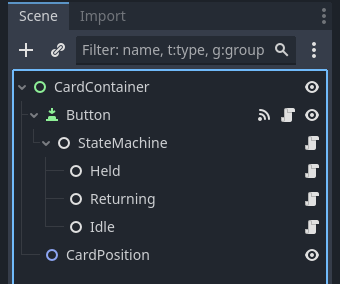

# Held-Effect

How the scene should be made when using the scripts 

    
    

        <h3>Your Title</h3>
        
Your description or text here. This text will align with the top or center of the image.

    

