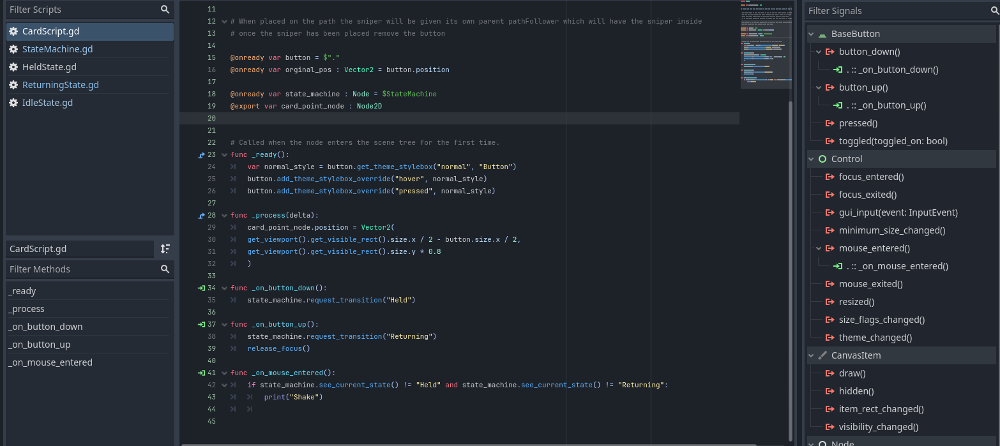

# Held Effect README rundown

    
    

        <h3>Scene Layout</h3>
        
As long as you have this basic stuff down there shouldn't be any issues

    

    
    

        <h3>Signal Connections Layout</h3>
        
The only signals from the button are used on the CardScript.gd Script

    

